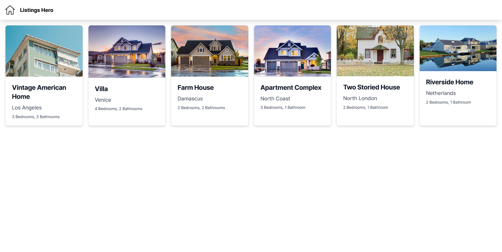

# Apartments Listing App <!-- omit in toc -->

- [:gear: Setup \& Usage](#gear-setup--usage)
  - [Using Docker](#using-docker)
- [:memo: Components](#memo-components)
  - [:ledger: Database](#ledger-database)
  - [:electric\_plug: Backend](#electric_plug-backend)
    - [Getting all listings](#getting-all-listings)
    - [Get listing by ID](#get-listing-by-id)
    - [Creating a new listing](#creating-a-new-listing)
  - [:desktop\_computer: Web Application](#desktop_computer-web-application)
  - [:iphone: Mobile Application](#iphone-mobile-application)
- [:toolbox: Points to improve](#toolbox-points-to-improve)
  - [Backend](#backend)
  - [Web App](#web-app)

Listings Hero is a simple listing appartments app. This repository hosts the backend, web application, db & mobile app.




## :gear: Setup & Usage

### Using Docker

The easiest way to get started is using docker compose.

Make sure that docker compose installed on your system by following the instructions [here](https://docs.docker.com/compose/install/)

Then, run the following command in the repository root

```Bash
docker compose up --build
```

This command builds & runs the images for backend, web app & database. It also seeds the database with dummy data for listings.


The web app should now be accessible at `http://localhost:3000` & the backend at `http://localhost:5000`


## :memo: Components

### :ledger: Database

The database used is MongoDB, with the following schema to represent apartment listings.

```typescript
name: string;
price: number;
location: string;
images: string[];
bedrooms: number;
bathrooms: number;
space: number;
amenities: string[];
```

### :electric_plug: Backend

The backend is built with Node.js using the following libraries:

- **Express**, for starting an http server.
- **Mongoose**, ORM for MongoDB.
- **Morgan**, for request logging.
- **dotenv**, to read env variables. 


The following endpoints are available:

#### Getting all listings

`GET` **/** `listings`

```json
// response, STATUS: 200
[
    {
        "name": "Farm House",
        "price": 150000,
        "location": "Damascus",
        "images": [
            "https://images.pexels.com/photos/1396122/pexels-photo-1396122.jpeg"
        ],
        "bedrooms": 2,
        "bathrooms": 2,
        "space": 400,
        "amenities": ["Garden", "Two Stories", "Bicycle Lanes", "Historical Places"],
        "id": "65f210ee38df3d8d17a34fde"
    }
]
```

#### Get listing by ID

`GET` **/** `listings/{id}`

```json
// response, STATUS: 200

{
    "name": "Two Storied House",
    "price": 20000,
    "location": "North London",
    "images": [
        "https://images.pexels.com/photos/1029599/pexels-photo-1029599.jpeg"
    ],
    "bedrooms": 2,
    "bathrooms": 1,
    "space": 180,
    "amenities": ["Premier League Matches", "London Bus", "Fish & Chips ?"],
    "id": "65f210ee38df3d8d17a34fe0"
}
```

#### Creating a new listing

`POST` **/** `listings`

```json
// request body

{
  "name": "Apartment Complex",
  "price": 220000,
  "location": "North Coast",
  "images": [
    "https://images.pexels.com/photos/106399/pexels-photo-106399.jpeg",
    "https://images.pexels.com/photos/186077/pexels-photo-186077.jpeg",
    "https://images.pexels.com/photos/1396122/pexels-photo-1396122.jpeg"
  ],
  "bedrooms": 3,
  "bathrooms": 1,
  "space": 1800,
  "amenities": ["Bowling Alley", "Garden", "Clubhouse", "Bicycle Lanes"]
}

// response, STATUS: 201

{
    "id": "65f0b74e1b78c67fadc2f813",
    "name": "Apartment Complex",
    "price": 220000,
    "location": "North Coast",
    "images": [
        "https://images.pexels.com/photos/106399/pexels-photo-106399.jpeg",
        "https://images.pexels.com/photos/186077/pexels-photo-186077.jpeg",
        "https://images.pexels.com/photos/1396122/pexels-photo-1396122.jpeg"
    ],
    "bedrooms": 3,
    "bathrooms": 1,
    "space": 1800,
    "amenities": ["Bowling Alley", "Garden", "Clubhouse", "Bicycle Lanes"]
}
```

### :desktop_computer: Web Application

Web application is built using the following frameworks/libs:

- **Next.js**, a React.js framework.
- **Tailwind**, a CSS utilities library for styling.

It has the following paths:

- `/listings`, a screen to show all listings.
- `/listings/${id}`, a screen to show a listing details.

 


### :iphone: Mobile Application

The mobile app is a close as possible translation of the web app using 

- **React Native**, for building native apps with web technologies.
- **Expo**, for scaffolding app & routing.
- **NativeWind**, a port of Tailwind to React Native.


## :toolbox: Points to improve

Generally, the following points can be implemented to improve maintainability & developer experience. Because of time constraints I decided to go without them.

- Paginating data in back & front ends.
- Multi step docker builds to reduce image sizes.
- Setting up linting rules.
- Setting up pre-commit hooks for formatting & enforcing commit naming conventions.
- Adding unit tests to protect against unintended side effects.
- Detailed setup instructions for each component to aid local development.

More specifically, the following can be done for each component

### Backend

- Add validation for incoming requests.
- Add more error types for common failures, currently only 404 is covered.

### Web App

- Responsiveness on big screens.